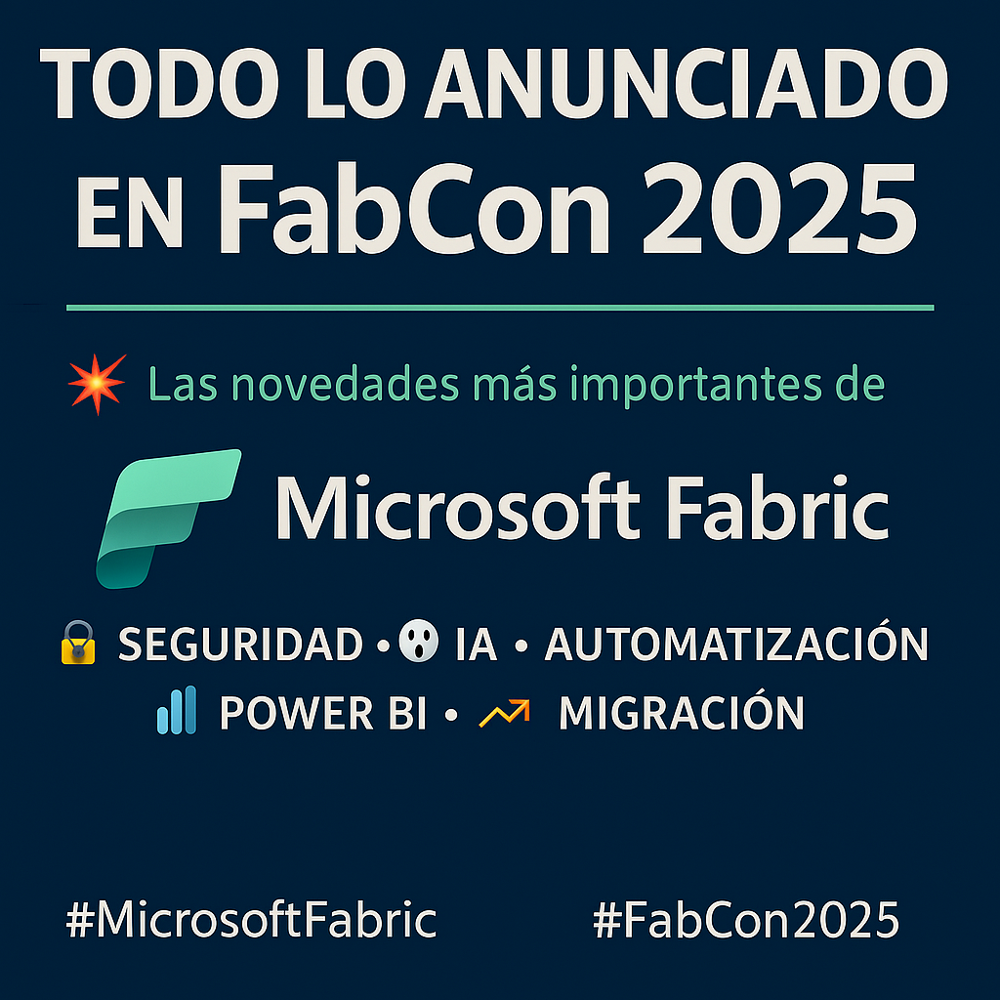

📝 **Nota**: Este resumen fue generado por ChatGPT a partir del contenido original publicado por Microsoft en el blog oficial de Fabric:  
🔗 [Fuente oficial](https://www.microsoft.com/en-us/microsoft-fabric/blog/2025/03/31/fabcon-2025-fueling-tomorrows-ai-with-new-agentic-capabilities-and-security-innovations-in-fabric/)

Este material no representa una transcripción literal, sino una síntesis organizada y traducida al español con fines informativos y educativos.

---

## 🔐 OneLake Security: protección granular de datos

- Define permisos una sola vez, aplicables en todo Fabric  
- Controla el acceso por carpetas, tablas o filas  
- Restringe automáticamente la vista de datos personales (PII)  
- Compatible con Power BI y SQL  
- Disponible pronto en vista previa

---

## 🤖 Agentes de datos + Azure AI Foundry

- Conectados con Azure AI Agent Service  
- Los agentes entienden y razonan sobre los datos  
- Creación de asistentes conversacionales con datos reales  
- Seguridad, precisión y contexto empresarial  
- Habilita experiencias AI realmente útiles

---

## 💡 Copilot y capacidades de IA para todos los SKUs

- Accesible desde F2 en adelante  
- Automatiza flujos, insights y tareas repetitivas  
- IA generativa integrada en Notebooks, Power BI y más  
- Sin coste adicional para planes de pago  
- Inspirado en el feedback de usuarios

---

## 🔄 Migración de Synapse a Fabric

- Nueva experiencia de migración integrada en la interfaz  
- Evaluación inteligente del entorno actual  
- Asistencia paso a paso con IA  
- Transición de código y datos sin complejidad  
- Todo dentro del ecosistema unificado de Fabric

---

## ⚙️ Mejoras en la Plataforma Fabric

- CLI en vista previa para ejecución por terminal  
- Nuevas capacidades CI/CD con GitHub y variables  
- User Data Functions reutilizables en notebooks y pipelines  
- Terraform Provider disponible (GA)  
- Tags para mejorar búsqueda y organización

---

## 🔗 Integración de datos

- Dataflow Gen2: refresh incremental (GA)  
- Conversión de Gen1 a Gen2 (preview)  
- Mirroring con PostgreSQL y gateways  
- Apache Airflow y Copy Job ya en disponibilidad general  
- Pipelines parametrizados y orquestación avanzada

---

## 📡 Plataforma en tiempo real

- Fabric Events (GA) para suscribirse a eventos de todo Fabric  
- Conectores nuevos: Weather, Solace, MQTT, ADX, Event Grid  
- Autenticación con Microsoft Entra ID  
- Acceso seguro y en tiempo real a datos y eventos  
- Integración nativa con OneLake y Workspaces

---

## 🧪 Ciencia e Ingeniería de Datos

- Copilot mejorado en notebooks con autocompletado contextual  
- Autoscaling Billing para Spark (preview)  
- Funciones de IA: resumen, clasificación, generación de texto  
- Procesamiento directo sobre datos en OneLake  
- Más eficiencia para data teams

---

## 🤝 Workloads de partners e ISVs

- GA: Osmos, Profisee, PowerBI.tips  
- Preview: Celonis, CluedIn, Neo4j, Lumel, Statsig, Striim  
- CluedIn se integra con Open Mirroring  
- Workload Hub crece con más opciones para ISVs

---

## 🌊 OneLake más conectado y flexible

- OneLake catalog ya en Excel (Office Insiders)  
- Shortcuts a S3 y Google Cloud mediante gateways  
- Compartición entre tenants: tablas, esquemas, SQL/KQL  
- Dataverse reflejado (nuevo) + virtualización mejorada  
- CI/CD para atajos y soporte MTO ya disponibles

---

## 📊 Fabric para usuarios de negocio

- Copilot en Power BI: pregunta en lenguaje natural  
- Modelos Direct Lake: sin refresh, sin duplicación  
- Tablas de múltiples artefactos en un solo modelo semántico  
- Anotaciones de datos en PowerPoint  
- Todo integrado con Microsoft 365

---

## 🛡️ Seguridad, gobierno y observabilidad

- Microsoft Purview + Copilot para detección de riesgos en prompts  
- DLP para KQL y bases reflejadas (preview)  
- Acciones automatizadas ante datos sensibles como SSNs  
- Observabilidad de datos en el catálogo unificado  
- Cumplimiento, gobernanza y gestión integrada

---

