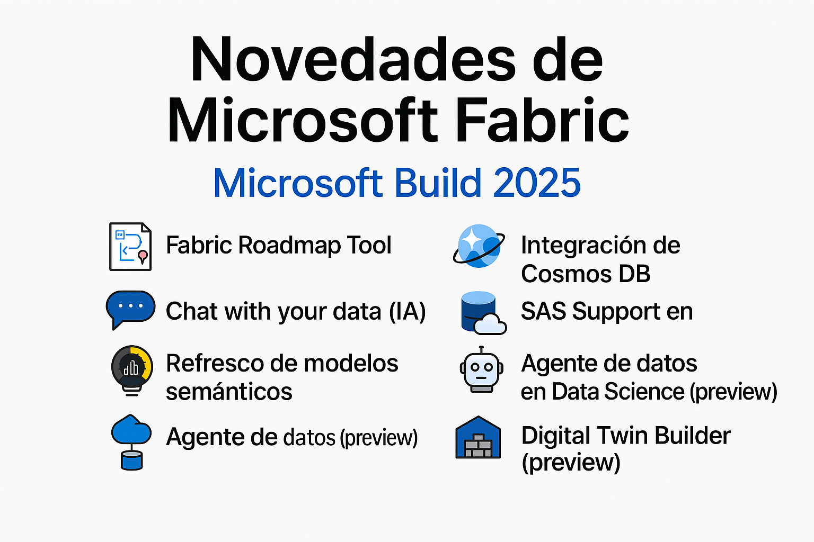

⚠️ **Nota**: Este resumen fue generado por ChatGPT con referencia al blog original: [Fabric May 2025 Feature Summary](https://blog.fabric.microsoft.com/en-us/blog/fabric-may-2025-feature-summary?ft=Monthly-update:category)

# ✨ Novedades de Microsoft Fabric – Microsoft Build 2025

## 📢 Eventos y anuncios

* **Lanzamiento de la herramienta Fabric Roadmap**
  Visualiza funciones próximas y en desarrollo dentro de Microsoft Fabric.

* **Inicio de temporada del Kusto Detective Agency: Call of the Cyber Duty**

---

## 📊 Power BI

* **Copilot con soporte para agentes de datos de Fabric**
  Mejora la interacción con tus datos usando inteligencia artificial.

---

## ⚙️ Plataforma Fabric

* **Nuevas APIs REST para pipelines de implementación**
* **Nuevas capacidades en la integración con Git**
* **Transformaciones de accesos directos (preview)**

---

## 🧪 Data Engineering

* Soporte en nuevas regiones para User Data Functions
* Soporte para SPN (Service Principal Name) en:

  * User Data Functions
  * API Livy
* Soporte de bibliotecas privadas en User Data Functions

---

## 🧠 Ciencia de Datos

* **Copilot en Power BI compatible con agentes de datos**
* **Integración del agente de datos de Fabric con Microsoft Copilot Studio (preview)**

---

## 🏗️ Data Warehouse

* **Snapshots de Data Warehouse (preview)**
  Captura del estado del almacén en puntos temporales para recuperación o auditoría.

---

## ⚡ Inteligencia en tiempo real

* **Ingesta continua desde Azure Storage a Eventhouse (preview)**
* **Soporte para Eventstream Derived Streams en modo de ingesta directa (preview)**
* **Importación de datos desde Lakehouse a Eventhouse usando OneLake Catalog**
* **Atajos acelerados a tablas de OneLake desde Eventhouse (GA)**

---

## 🧩 Bases de datos

* **Integración de Cosmos DB con Microsoft Fabric (preview)**

---

## 🔄 Data Pipelines

* **Soporte nativo de Change Data Capture (CDC) en Copy Job (preview)**
* **Actividad de refresco de modelos semánticos (GA)**
* **Copilot para pipelines de datos**
  Facilita comprensión y edición de flujos con ayuda de IA.

---

## 🪞 Mirroring (Espejado de datos)

* **Mirroring para SQL Server On-Premises (preview)**
* **Mirroring para SQL Server 2025 (preview)**
* **Nuevas funciones para Azure SQL Managed Instance**
* **Personalización del período de retención de datos espejados**
* **Expansión regional para mirroring en Azure PostgreSQL**
* **Mirroring para Azure Cosmos DB con nuevas funciones (preview)**

---

## 🔄 Dataflow Gen2

* **CI/CD en Dataflow Gen2 (GA)**
* **APIs públicas de Dataflow Gen2 (preview)**
* **Soporte para parámetros en Dataflow Gen2 (preview)**
* **Lakehouse como destino con refresco incremental (preview)**
* **Archivos de SharePoint como destino (preview)**
* **De lenguaje natural a columna personalizada**
  Generación de columnas con descripciones en lenguaje natural.

